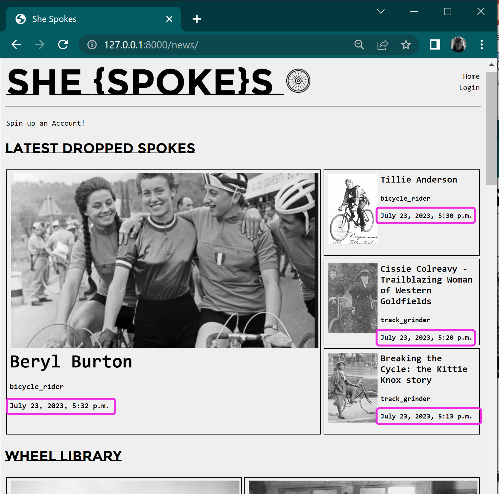
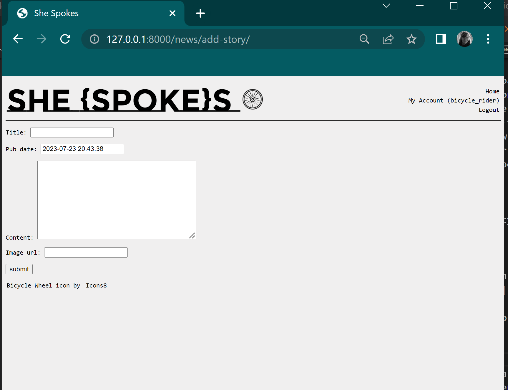
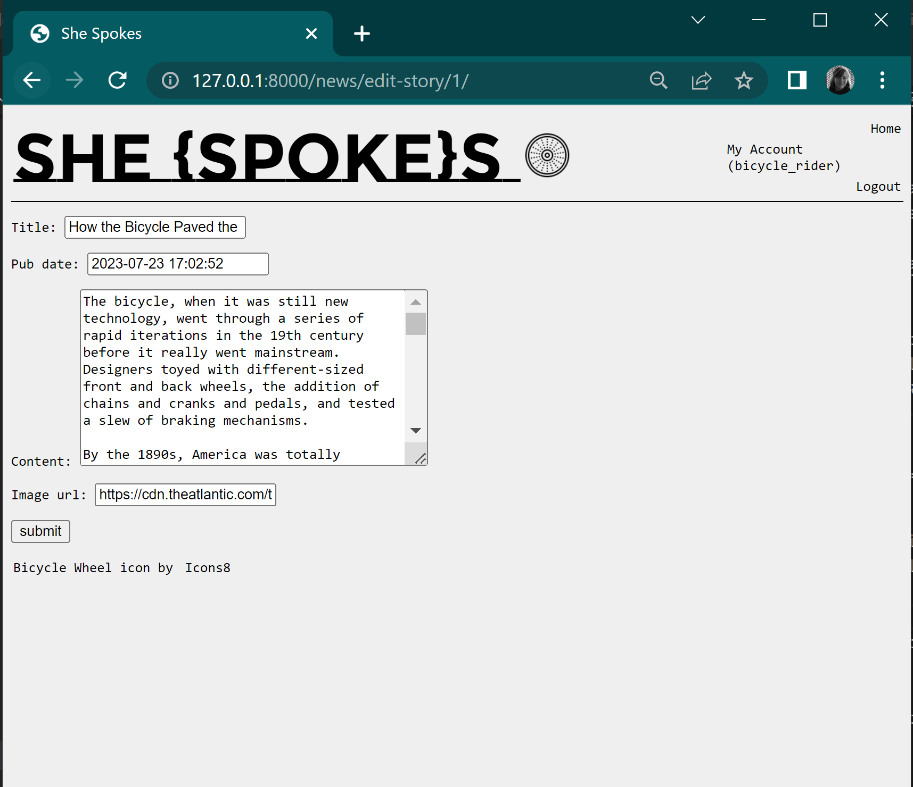
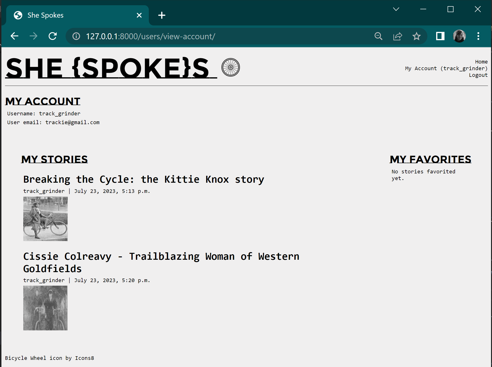
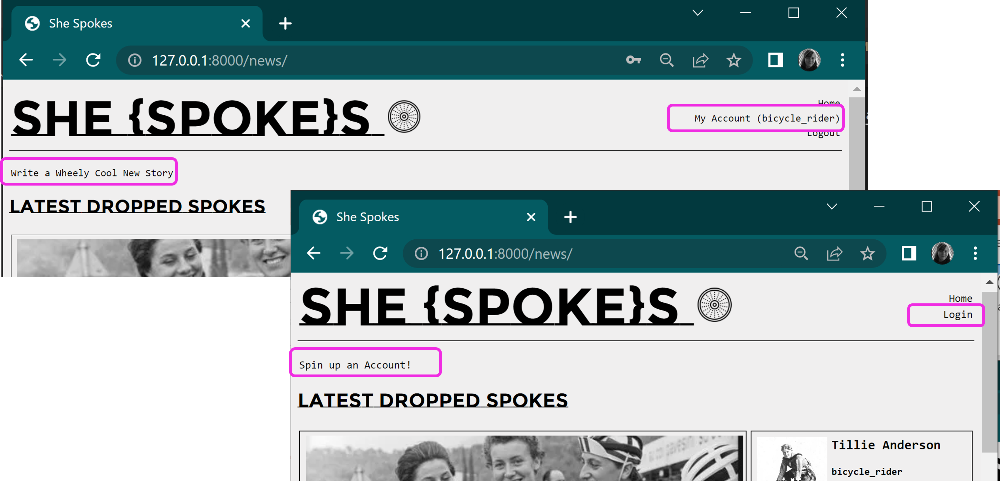
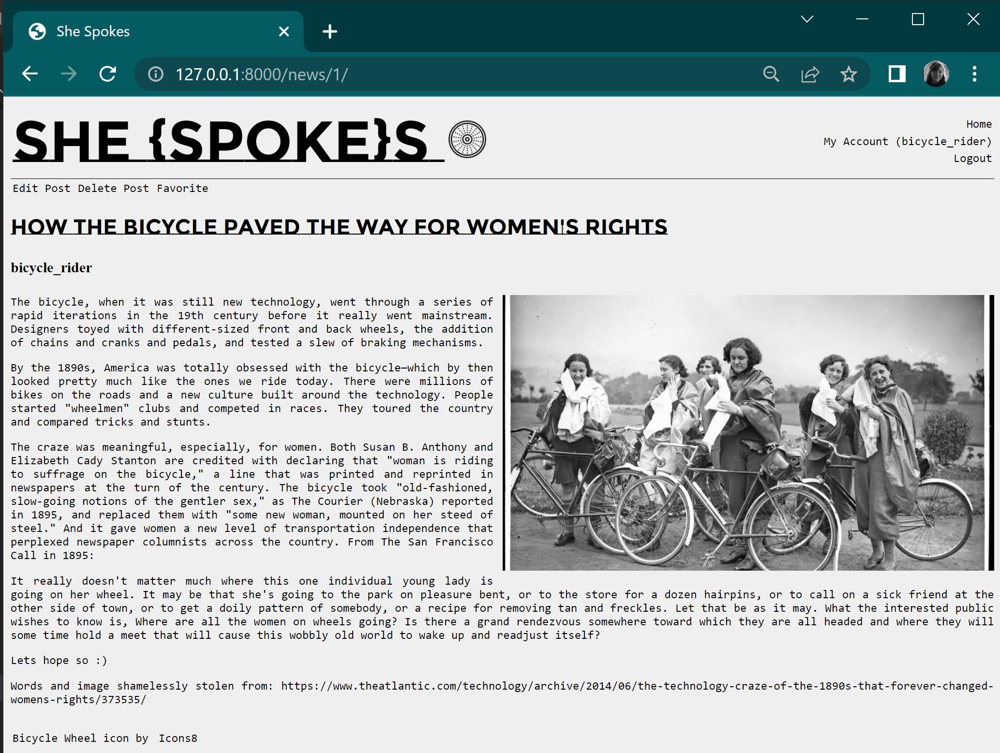
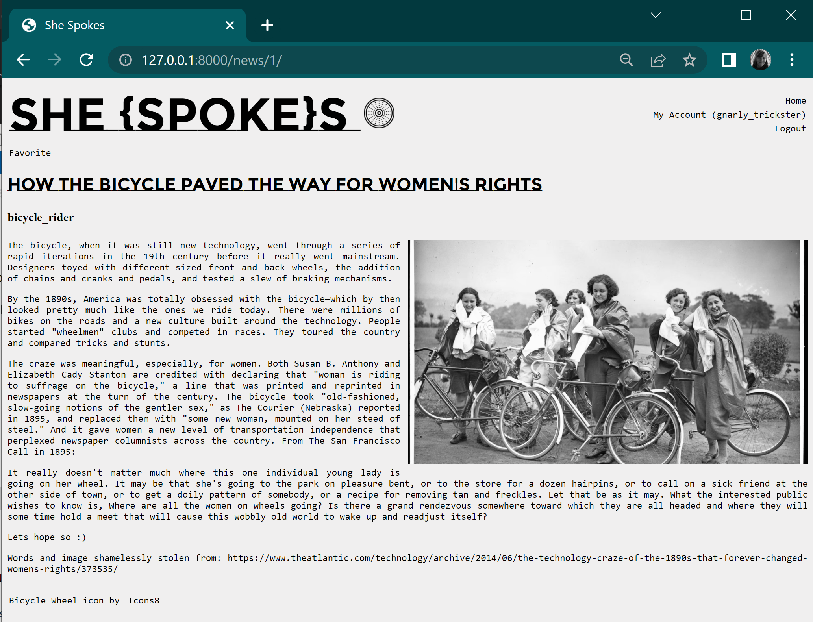
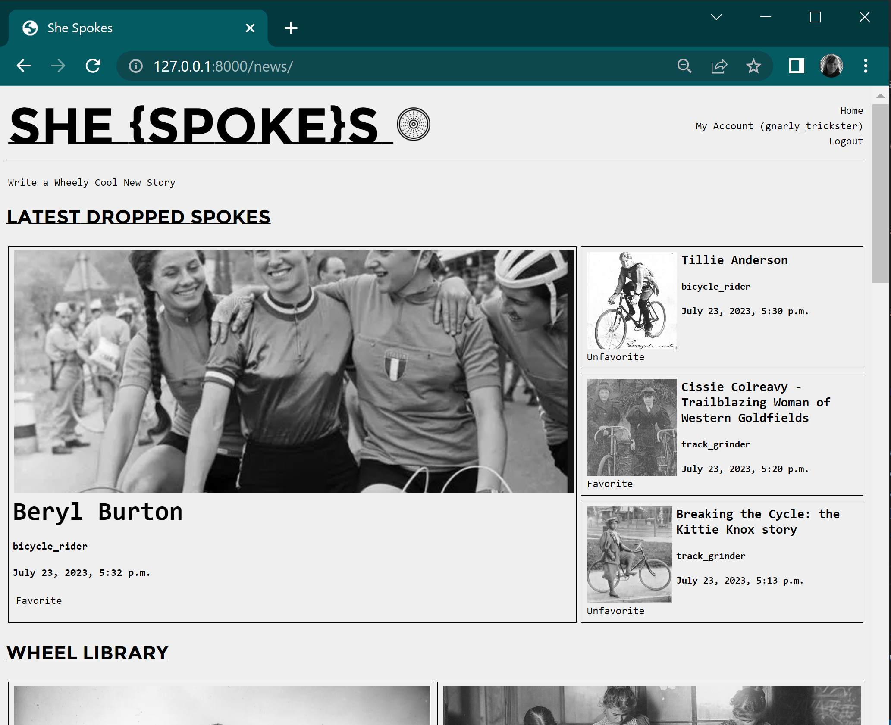
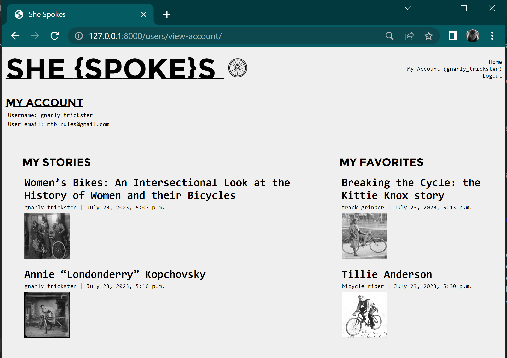

# {{ Maya Dominice }} - She Codes Django Project

## About This Project
The project is an extension of the template provided by the She Codes Australia course and is based around a news/blog site, with features/functionality added to help build out the addition, editing and deleting of posts as well as creating accounts. 

## How To Run This Code
Assumptions:
Python 3.0 onwards is installed
pip is installed

Clone the repo to your local machine to the desired location.

Create an virtual environment in the same desired location and using a terminal, activate the environment using the commands applicable to your OS, such as `.venv/Scripts/activate`

Remaining in the terminal, run the installation of the components listed in the requirements.txt (to ensure Django is installed) by using the following command:
`python -m pip install -r requirements.txt`

Once completed, prepare the Django project through the migration steps:

- Change directories one level down, into 'she_codes_news'
- Prepare migrations by running the command `python manage.py makemigrations`
- Run the migrations by running the command `python manage.py migrate`
- If you'd like to use the sample/created data for the project, run the command to load the data to the SQLite database: `python manage.py loaddata news` and then again for users `python manage.py loaddata users`

After migration, run the Django server with the command `python manage.py runserver` and go to http://127.0.0.1:8000/news/

{{Give a quick step-by-step guide on how to download and run your codebase.It's ok to assume the reader is another developer here, so don't feel like youhave to explain what a virtual environment is, etc.Give directions like "clone the repo to your local machine", "create a virtualenvironment", "migrate the database", etc. When you need to specify terminal commands, you can surround them withbackticks, like so: `python manage.py runserver`. This formats them ascode in the markdown document. (The backtick key is to the left of thenumber 1 at the top of your keyboard.)}}

## Database Schema!
[ {{ My ERD }} ]( {{ ./relative_path_to_your_entity_relationship_diagram }} )

## Project Features
- [x] Order stories by date
This was implemented in the news app views.py with the following line 
`NewsStory.objects.order_by('-pub_date').all()[:4]` for the 'latest stories' component.

- [x] Styled "new story" form
This was implemented by using the 'CreateView' class, along with html templates and form. It was further customised so that only authenticated users could access the page.

- [x] Story images
The form was altered to allow users to add a URL to an image. This was acheived using the URLField type and altering the html template logic to show the image URL. I would have liked to include a test/logic to check the URL was returning a valid image (instead of eg base64), and if not then present the user a default stored image, but ran out of time 😞

- [x] Log-in/log-out
A login/logout link/button was created by generating a new app 'users' and then using the Django 'requests' (magic) to check in the html wheather or not a user was logged in and to present the relevant text/link. The login page was implemented with forms/html and the ootb functionality.

- [x] "Account view" page
This was completed by creating a new html template and view class to pull information about the user and was then extended to show the users stories, and the stories they'd favorited.

- [x] "Create Account" page
In a similar this was created alongside the 'view account' page and uses the Django ootb UserCreationForm and CreateView to allow users to sign up. Some login was also added to the base and login html templates to show 'login' or 'sign-up' options depending on user authentication

- [x] View stories by author
This was implemented through the authenticated user, but ran out of time to figure out how to do this via search/dropdown/link if a user is anonymous (was aiming to do this while do the article categories, but couldn't quite there)

- [x] "Log-in" button only visible when no user is logged in/"Log-out" buttononly visible when a user *is* logged in
This was bundled with the login/account view step 😄

- [x] "Create Story" functionality only available when user is logged in
I approached this by using the same request.user.is_authenticated approach in the html templates. I wanted to include a link to create a story in the 'view account' page but only realised I forgot to do it as I type this and it's like....11:30 :-/

## Additional Features:
- [ ] Add categories to the stories and allow the user to search for stories bycategory.
Didn't quite get to this one - next time :D

- [x] Add the ability to update and delete stories (consider permissions - whoshould be allowed to update or and/or delete stories).
I enabled this through the 'story detail' html templalte using the same request.user.is_authenticated logic to control access to the edit/delete links. 

If author is logged in:

If no one logged in:

If another user logged in:

- [x] Add the ability to “favourite” stories and see a page with your favouritestories.

This was hard! I think I sort of got it to work (with final bit of help from wonderful Slack community). I created a new field in the news app model for 'favorites' which was a ManyToMany field and linked to user app tables. I then used the same logic of 'is user authenticated' in the html to alternate showing/hiding the option to favorite a story. I also extended this to a users 'view account' page to show their favorited stories.

Homepage version

View account version

- [o] Our form for creating stories requires you to add the publication date,update this to automatically save the publication date as the day thestory was first published (maybe you could then add a field to showwhen the story was updated).

I only partially got to this one - altered the field type/display in the story model to automatically take the 'timenow', rather than a manual input but didn't quite get to including an 'updated date'.

Thanks for a wonderful 3 weeks of learning Django magic! ✨
